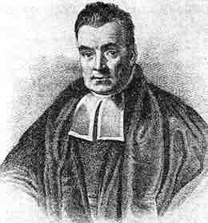

# Introduction

This document is a template demonstrating the Apaish format. This document is a template demonstrating the Apaish format. This document is a template demonstrating the Apaish format. 

Second paragraph is indented by default. Second paragraph is indented by default. Second paragraph is indented by default. Second paragraph is indented by default.

## Level 2

Flush Left, Bold, Title Case Heading

### Level 3

Flush Left, Bold Italic, Title Case Heading

#### Level 4

Indented, Bold, Title Case Heading, Ending With a Period. Text begins on the same line and continues as a regular paragraph.

##### Level 5

Indented, Bold Italic, Title Case Heading, Ending With a Period. Text begins on the same line and continues as a regular paragraph.

## Markdown

Markdown should be sufficient for formatting stuff: *Italics*, **bold**.

> *Blockquotes*: This document is a template demonstrating the Apaish format. This document is a template demonstrating the Apaish format. This document is a template demonstrating the Apaish format.

- Lists
  - Level 2 item

# Methods

Maths (LaTeX) inline ($E=mc^2$) and blocks:

$$
x^2 + y^2 = z^2.
$$ {#eq-1}

The latter are easily cited (e.g. @eq-1).

# Results

## Code

```{r}
pi / 3
```

## Tables

Typst tables are currently somewhat limited (<https://typst.app/docs/reference/layout/table/>).

```{r}
#| label: tbl-1
#| tbl-cap: Mtcars table.
#| echo: false

library(gt)
mtcars[1:6, 1:6] |> 
  gt() |> 
  tab_footnote("Footnote cell 1.", cells_column_labels(1))
```

@tbl-1 shows what happens if you run `mtcars[1:6, 1:6]` in R [@R].

## Figures

Figures are just fine.

```{r}
#| label: fig-1
#| fig-cap: Mtcars figure.
#| fig-width: 8
#| fig-height: 3
#| echo: false

plot(mtcars[, 3:5])
```

@fig-1 shows what happens if you run `plot(mtcars[, 3:5])` in R [@R].

{#fig-bayes}

You can also embed figures from files using Markdown syntax: `{#fig-bayes}` shows @fig-bayes.

# Discussion

This document is a template demonstrating the Apaish format. This document is a template demonstrating the Apaish format. This document is a template demonstrating the Apaish format. This document is a template demonstrating the Apaish format. This document is a template demonstrating the Apaish format. This document is a template demonstrating the Apaish format. This document is a template demonstrating the Apaish format. This document is a template demonstrating the Apaish format.

This document is a template demonstrating the Apaish format. This document is a template demonstrating the Apaish format. This document is a template demonstrating the Apaish format. This document is a template demonstrating the Apaish format.

```{=typst} 
#bibliography("bibliography.bib", title: "References", style: "apa")
```

# Appendices

Additional information.
